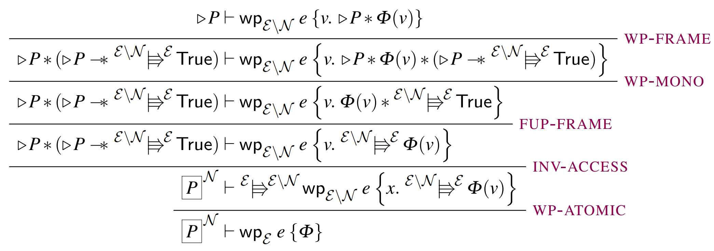

# Introduction

## Introduction
* Concurrent Separation Logic(CSL): a tool for formal verification of correctness of concurrent programs
* Iris: SOTA CSL _framework_. You can
    * instantiate Iris with your own programming language, and
    * encode various reasoning mechanisms from other CSLs.
    * Caveat: the property is valid only when the program terminates (partial correctness)

What's your goal?

## Resources
* Iris
    * [**tutorial-POPL18**](https://gitlab.mpi-sws.org/iris/tutorial-popl18)
    * [**Lecture Notes**](https://iris-project.org/tutorial-material.html)
    * [Iris examples](https://gitlab.mpi-sws.org/iris/examples)
    * [Ground-Up (theories)](https://people.mpi-sws.org/~dreyer/papers/iris-ground-up/paper.pdf)
    * [documentations](https://gitlab.mpi-sws.org/iris/iris/tree/master/docs):
      Iris Proof Mode, Heap lang, editor setups, ...

## Supplementary Resources
* Hoare logic
    * [2017fall CS492 Program Analysis](https://plrg.kaist.ac.kr/doku.php?id=home:lectures:cs492_2017_2)
        - basic: section 5 of "Proof Methods"
        - weakest preconditions: "Predicate Transformers"
* Separation logic
    * [CACM 2019-2](https://cacm.acm.org/magazines/2019/2/234356-separation-logic/pdf)
* [Formal Reasoning About Programs](https://frap.csail.mit.edu/main)

# Basics of (sequential) separation logic

## Hoare Logic
A logic for proving program specifications (a.k.a. Hoare triples) of form
$$
\hoare{\text{precondition}}{\texttt{code}}{\text{postcondition}}
$$

* Run the code in a state satisfying the precondition.
    * It runs safely (\eg doesn't get stuck).
    * If it terminates, the resulting state satisfies the postcondition.
$$
\hoare{x=0,y=1}{\texttt{x := x + 1; y := x + y}}{x=1,y=2}
$$
How to prove the specification?

## Hoare Logic Inference Rules
Under the assumptions $H_0,...,H_n$ we can derive $C$:
$$
\infer{ H_0\\ \cdots \\ H_n } { C }
$$
Hoare logic inference rules for each programming language construct:
$$
\infer [HOARE-SEQ] {
    \hoare{P_0}{\texttt{b0}}{P_1}\\
    \hoare{P_1}{\texttt{b1}}{P_2}
} {
    \hoare{P_0}{\texttt{b0; b1}}{P_2}
}
$$
$$
\infer [HOARE-IF] {
    \hoare{P\land e}{\texttt{b0}}{Q}\\
    \hoare{P\land \neg e}{\texttt{b1}}{Q}
} {
    \hoare{P}{\texttt{if (e) b0 else b1}}{Q}
}
$$
Note that inference rules themselves should be proved sound \wrt the semantics of the language.

## Separation Logic
Problem: Hoare logic doesn't work well for _large_ programs involving _pointers_ (shared mutable states $\to$ lots of interference to consider).

Solution: Separation Logic introduces the concept of the **"exclusive ownership of resources"** to enable enables the modular & scalable verification of pointer-manipulating programs.

Intuitive understanding of a separation logic proposition:

* it asserts the ownership of resources.
* it describes resources.

Resource? \eg heap memory $Loc\xrightarrow{\text{fin}}Val$.

## "Points-to" $l\mapsto v$
* Ownership of a heap fragment (heaplet) at location $l$ with value $v$
    * The owner can modify what $l$ points to
    * without invalidating invariants of other parts/threads of the program.
* $\hoare{l\mapsto 5}{l\leftarrow !l+1}{v,v=()\land l\mapsto 6}$
* $\hoare{True}{ref(123)}{v,\exists l.v=l\land l\mapsto 123}$

## Separating conjunction $P\ast Q$
* A resource that can be **separated** into 2 resources $P$ and $Q$
$$\hoare{l_1\mapsto v_1\ast l_2\mapsto v_2}{\texttt{swap}\,l_1\,l_2}{v,v=()\land l_1\mapsto v_2\ast l_2\mapsto v_1}$$
* _frame rule_: irrelevant resources remain the same
$$\infer{\hoare{P}{e}{v,Q}}{\hoare{P\ast R}{e}{v,Q\ast R}}$$
\begin{gather*}
\{l_1\mapsto v_1\ast l_2\mapsto v_2\ast l_3\mapsto v_3\}\\
\texttt{swap}\,l_1\,l_2 \\
\{v,v=()\land l_1\mapsto v_2\ast l_2\mapsto v_1\ast l_3\mapsto v_3\}
\end{gather*}
* $P$ and $Q$ are disjoint:
    * $l\mapsto v_1 \ast l\mapsto v_2 \proves False$
* vs. $P\land Q$: resource satisfying both $P$ and $Q$
    * $l\mapsto v_1 \land l\mapsto v_2 \proves v_1 = v_2$ (agreement)

## Magic wand $P\wand Q$
* Resources that satisfies $Q$ when extended with resources satisfying $P$ ($Q$ minus $P$)
    * $x\mapsto u \wand (x\mapsto u\ast y\mapsto v)$ is like $y\mapsto v$
    * $\exists v. (x\mapsto v) \ast (x\mapsto 3 \wand Q)$:
      $x$ is allocated, if you mutate its contents to 3 then you get a resource that satisfies $Q$
* vs. $P\Rightarrow Q$: satisfies $Q$ if the same resource additionally satisfies $P$

## Laws of (affine) separation logic
\begin{gather*}
\TRUE * P \provesIff P\qquad
P * Q \proves Q * P \qquad
(P * Q) * R \proves P * (Q * R)\\
P\ast Q\proves P\\
\infer[$*$-mono]
  {P_1 \proves Q_1 \\ P_2 \proves Q_2}
  {P_1 * P_2 \proves Q_1 * Q_2} \qquad
\infer[$\wand$I]
  {R\ast P \proves Q}
  {R \proves P \wand Q}\qquad
\infer[$\wand$E]
  {R_1 \proves P\wand Q \\ R_2\proves P}
  {R_1\ast R_2 \proves Q}
\end{gather*}

Note

* $P\ast Q\proves P\land Q$
* $P\land Q\proves P\ast Q$ if $P$ _persistent_

# Separation logic in Iris Proof Mode

## Demo: POPL18 tutorial `exercises/ex_01_swap.v`
<https://gitlab.mpi-sws.org/iris/tutorial-popl18>

### Texan triples?
```
{{{ P }}} e {{{ RET v, Q }}}
```
$\,$ <!-- the padding above the quot is too small -->

> I think "Texan triple" would be a good name, seeing how everything is bigger
> in Texas, including the number of curly braces.
>
> -- [Janno](https://gitlab.mpi-sws.org/iris/iris/merge_requests/9#nomenclature)

## Where did my Texan triple go? (1/2)
* It's just a notation:
$$
\hoare{P}{e}{v,Q}\triangleq \always(P\wand \wpre{e}{v,Q})
$$
* $\wpre{e}{v,Q}$?: the weakest(most general) precondition of program $e$ and postcondition $Q$
    * why? systematic proof process. (`wp_*` tactics)
    * Start with the postcondition, go backwards, and try to get to something the precondition implies
    * $\wpre{x\leftarrow 3}{Q}= \exists v. (x\mapsto v) \ast (x\mapsto 3 \wand Q)$

## Weakest preconditions
$$
\infer[WP-STORE]{}{
    l\mapsto v\ast\later(l\mapsto w\wand\Phi())\proves \wpre{l\leftarrow w}{\Phi}
}
$$
$$
\infer[WP-ALLOC]{}{
    \later(\forall l. l\mapsto v \wand\Phi())\proves \wpre{\texttt{ref}(v)}{\Phi}
}
$$
$$
\infer[WP-$\lambda$]{}{
    \later\wpre{e[v/x]}{\Phi} \proves
    \wpre{(\lambda x.e) v}{\Phi}
}
$$
$$
\infer[wp-mono] {
    \forall v. P(v) \proves Q(v) \\
} {
    \wpre\expr{\Ret\var.P} \proves
    \wpre\expr{\Ret\var.Q}}
$$

## Where did my Texan triple go? (2/2)
* another equivalence (continuation)
\begin{align*}
\hoare{P}{e}{v,Q}&\triangleq \always(P\wand \wpre{e}{v,Q})\\&\cong
\always(\forall\Phi, P\wand (Q\wand \Phi\,v) \wand \wpre{e}{v,\Phi\, v})
\end{align*}
* why? convenience of application of the spec to other proofs

## `wp_bind`
* evaluation context: $(1+2)+4 \to (\Box + 4)[1+2]\to (\Box + 4)[3]\to 3+4 \to 7$

$$
\infer[HT-BIND]{
    \hoare{P}{e}{v,Q}\\ \forall v.\hoare{Q}{E[v]}{w.R}
} {
    \hoare{P}{E[e]}{w.R}
}
$$
$$
\infer[WP-BIND]{}{\wpre{e}{v, \wpre{E[v]}{\Phi}} \proves \wpre{E[e]}{\Phi}}
$$

## Modalities: "later" $\later$
* $\later P$ holds if $P$ holds after a reduction step
* why? logical soundness
* introduction
    * weaken: $P\proves \later P$, `iNext` tactic
    * opening invariants
* elimination
    * step
        * strengthened Hoare triples (lecture note 5.1), `wp_*` tactics
          $$\hoare{\later l\mapsto u}{!l}{v, v=u\land l\mapsto u}$$
        * HT-FRAME-ATOMIC
    * timeless (propositions that doesn't refer to other invariants, most of innocent propositions): FUP-TIMELESS, `> ipat` intro pattern

## Lőb induction
$$
\infer[Lőb]{Q\land\later P\proves P}{Q\proves P}
$$
\todo

## Modalities: "persistently", "always" $\always$
* non-exclusive, shareable (duplicable) "knowledge"
* equality, Hoare triples, **invariants**, induction hypothesis, ...
$$
\infer{P\proves\always P\ (P\text{ is persistent})}{P\proves P\ast P}\quad
\inferB [HT-ALWAYS]
    { \always Q\land S \proves \hoare{P}{e}{v,R} }
    { S \proves \hoare{\always Q\land P}{e}{v,R} }
$$
$$
\hoare{P}{e}{v,Q}\triangleq \always(P\wand \wpre{e}{v,Q})
$$
Using the $\always$ modality guarantees that all the non-persistent (exclusive)
resources required by $e$ are contained in $P$.

\todo


# Concurrent Separation Logic

## Today's goal
Prove
$$
\hoare{l\mapsto 0}{(l\leftarrow 0 || l\leftarrow 1); !l}{v.v=0\lor v=1}
$$

How? [lecture 9: invariants](https://iris-project.org/tutorial-pdfs/lecture9-invariants.pdf)


## Invariant $\knowInv{\iota}{P}$
* Shareable knowledge that there exists a resource satisfying $P$ (think: pointer)
* To establish $\knowInv{\iota}{P}$, sacrifice $P$.
* Use with care!
    * Each thread can temporarily (for a single atomic step) own $P$.
    * The user should return $P$ to the $\knowInv{\iota}{P}$.
    * The user cannot access the same invariant at the same time (thus the name $\iota$ and mask $\mask$ are needed).


## Invariant namespace $\namesp$
* similar to the concept of namespace in programming
\begin{align*}
\namesp &= \texttt{org.iris.lock}\\
\namecl\namesp &= \texttt{org.iris.lock.*}
\end{align*}
* used for controlling set of invariants names easily
$$
\knowInv{\namesp}{P}\triangleq \exists \iota\in \namecl\namesp. \knowInv{\iota}{P}
$$

\begin{tiny}
(Details in Lecture Note 11.5)
\end{tiny}

## Invariant rules with $\namesp$
$$
\infer[HT-INV-ALLOC] {
    \mask \textsf{ infinite} \\
    \knowInv{\namesp}{I}\proves
    \hoare{P}{e}{v,Q}[\mask]
} {
    \hoare{\later I\ast P}{e}{v,Q}[\mask]
}
$$
$$
\infer[HT-INV-ACESS] {
    e \textsf{ atomic} \\
    \namesp\subset\mask\\
    \hoare{\later I\ast P}{e}{v,\later I\ast Q}[\mask\setminus\namesp]
} {
    \knowInv{\namesp}{I}\proves
    \hoare{P}{e}{v,Q}[\mask]
}
$$

# Concurrent Separation Logic in Iris Proof Mode

## Demo: coin flip
<!-- <https://gitlab.mpi-sws.org/iris/examples/blob/master/theories/lecture_notes/coq_intro_example_1.v> -->
<https://gitlab.mpi-sws.org/iris/tutorial-popl18/blob/master/talks/demo/part3.v>


## Invariants + weakest preconditions
$$
\infer{
    e \textsf{ atomic} \\
    \namesp\subset\mask\\
    \hoare{\later I\ast P}{e}{v,\later I\ast Q}[\mask\setminus\namesp]
} {
    \knowInv{\namesp}{I}\proves
    \hoare{P}{e}{v,Q}[\mask]
}
$$
$$
\infer[WP-INV] {
    e \textsf{ atomic} \\
    \namesp\subset\mask\\
    \later I\proves \wpre{e}[\mask\setminus\namesp]{v,\later I\ast Q}
} {
    \knowInv{\namesp}{I}\proves \wpre{e}[\mask]{v,Q}
}
$$

* INV-ALLOC?: Soon^TM^
<!-- WP-FRAME-STEP (lecture note 113, not necessarily atomic, but at least reducible) -->

##
\begin{tiny} Group-up page 61 \end{tiny}


3rd floor (the one right on top of INV-ACCESS) of the proof tree is what we actually prove in Iris Prove mode with `iInv` tactic.


## Fancy update modality $\pvs[\mask_1][\mask_2]$
$\pvs[\mask_1][\mask_2]$ contains resources which,
together with resources in invariants names $\mask_1$,
can be updated (via _frame preserving update_) to resources which can be split into
resources satisfying $P$ and resources in invariants named $\mask_2$.

The meaning of "updating" will be discussed more in the next part (_ghost states_).
For now, we focus on the difference of the masks $\mask_1$ and $\mask_2$.

$$
\infer[fup-intro-mask]
{\mask_2 \subseteq \mask_1}
{P \proves \pvs[\mask_1][\mask_2]\pvs[\mask_2][\mask_1] P}\qquad
\infer[fup-trans] {}
{\pvs[\mask_1][\mask_2] \pvs[\mask_2][\mask_3] P \proves \pvs[\mask_1][\mask_3] P}
$$
$$
\infer[fup-intro] {}
{P\proves \pvs[\mask]P}
$$

##
$$
\infer[inv-alloc]{}{\later P \proves \pvs[\mask] \knowInv{\namesp}{P}}
$$
$$
\infer[inv-access(open\&close)] {\namesp \subseteq \mask} {
    \knowInv{\namesp}{P} \proves
    \pvs[\mask][\mask\setminus\namesp] (
        \later P \ast (\later P \wand \pvs[\mask\setminus\namesp][\mask] \TRUE)
    )
}
$$
$\pvs[\mask\setminus\namesp][\mask] \TRUE$: resources which can be combined
with resources in invariants in $\mask\setminus\namesp$ to get resources in
invariants in $\mask$, \ie it contains the resources in the invariants in
$\namesp$.
$$
\infer[fup-timeless] {\timeless P}
{\later P \proves \pvs[\mask]  P}
$$

<!-- * FUP-FRAME: 2 simpler parts -->

<!-- ground up figure 15 -->

## Fancy view shift $\vs[\mask_1][\mask_2]$
$$
P\vs[\mask_1][\mask_2]Q\triangleq \always(P\wand\pvs[\mask_1][\mask_2]Q),\quad
P\vsW[\mask_1][\mask_2]Q\triangleq P\wand\pvs[\mask_1][\mask_2]Q
$$
Just a matter of presentation.
$$
\infer[INV-ALLOC]{}{P\vs[\mask]\knowInv{\namesp}{P}}\qquad
\infer[HOARE-VS] {
    P\vs[\mask]P'\\
    \hoare{P'}{e}{v,Q'}[\mask]\\
    Q\vs[\mask]Q'\\
} {
    \hoare{P}{e}{v,Q}[\mask]
}\qquad
$$
$$
\infer[fvs-timeless] {\timeless P}
{\later P \vs[\mask]  P}
$$

<!--
$$
\infer[HT-FRAME-STEP] {
    e\notin\Val\\
    \mask_2\subset\mask_1\\
    R_1\vs[\mask_1][\mask_2]\later R_2\\
    \hoare{P}{e}{v,Q}[\mask_2]\\
    R_2\vs[\mask_2][\mask_1] R_3
} {
    \hoare{P\ast R_1}{e}{v,Q\ast R_3}[\mask_1]
}\qquad
$$
proof? why is this necessary and how is it difference from timeless stuff??  -->

<!-- ground up figure 4 -->

<!-- how to connect the result of timeless stuff to proof? ok to eliminate? frame-preseving update? -->
<!-- NOTE:
* https://github.com/matze/mtheme
* slide_level:2 -> all contents under at least 2 #'s
* setting `urlcolor` sets `colorlinks` which changes toc color too
* TODO: \pause, handout
* https://github.com/matze/mtheme/issues/280
* lol this comment block creates a new empty slide if it's placed at the top
-->
